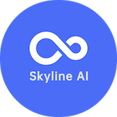

# SkylineAI OJ

> Solve SkylineAI Python homework problems in VS Code.

<p align="center">
  
</p>

SkylineAI OJ is a refactor of the original VS Code LeetCode extension into a classroom-oriented online judge for Python students. The target product is a VS Code extension backed by a single self-hosted service that owns classroom data, homework assignment data, submissions, leaderboards, and Python 3.13 judging.

The extension code still contains legacy LeetCode command IDs and package metadata while the migration is in progress. New SkylineAI integration code is enabled through the `skylineOj.*` settings described below.

## Product Goals

- Students can sign in, browse assigned homework, open problems, write Python solutions, submit from VS Code, and review judging results.
- Teachers can migrate existing OJ data, organize users into groups/classes, assign homework, and review per-homework leaderboards.
- The backend exposes RESTful APIs for problems, homework, submissions, users, groups, and leaderboards.
- The judging path is Python 3.13 only, which keeps the infrastructure simpler than a general multi-language OJ.
- Historical MongoDB backup data from the previous OJ can be transformed into the new application collections.

## Current Status

Implemented in this branch:

- Migration scripts for Hydro/MongoDB backup data under `scripts/migration/`.
- Application collection design and migration validation checks.
- Backend scaffold under `backend/` with route registration, auth/RBAC helpers, read-model services, submission orchestration, and judge worker modules.
- Database-backed username/password authentication with scrypt password hashes and signed access tokens.
- Python judge runner scaffold with result mapping for accepted, wrong answer, runtime error, time limit, and memory limit states.
- VS Code extension API client and command integration that use SkylineAI OJ when `skylineOj.backendUrl` is configured.
- Cutover and rollback runbooks under `docs/migration/`.

Not complete yet:

- Auth0 integration, token refresh, and centralized session revocation. The current implementation uses local database accounts and one-hour signed access tokens.
- Production-grade sandbox hardening and deployment packaging for the Python judge worker.
- Full extension renaming from legacy LeetCode package metadata and command IDs.
- Teacher/admin UI workflows for managing classes and homework.

## Architecture

```text
VS Code extension
  -> SkylineAI OJ REST API
      -> MongoDB application database
      -> Python 3.13 judge queue and worker
      -> sandboxed solution execution
```

The backend is intentionally the single integration point for the extension. It owns both classroom data and judging orchestration so the extension does not need to talk to Judge0 or directly understand migrated MongoDB backup schemas.

## Extension Configuration

Add these settings to VS Code `settings.json` when testing the SkylineAI backend path:

```json
{
  "skylineOj.backendUrl": "http://localhost:3000"
}
```

`skylineOj.backendUrl` selects the SkylineAI backend. The default local development value is `http://127.0.0.1:3000`.

Use the sign-in button in the SkylineAI Explorer to enter a username and password. The extension sends them to `POST /v1/auth/login` and stores only the returned access token and user profile in VS Code SecretStorage.

Initialize a migrated user's password before login:

```bash
cd backend
MONGO_URI='mongodb://localhost:27017' \
USER_PASSWORD='temporary-password' \
npm run set-password -- student1
```

Run the database-backed authentication server:

```bash
cd backend
MONGO_URI='mongodb://localhost:27017' \
MONGO_DB='oj_app' \
AUTH_TOKEN_SECRET='replace-with-a-long-random-secret' \
npm start
```

## Local MongoDB Deployment

The repository includes a Docker Compose stack for local storage and backend
authentication. It provides:

- MongoDB 7 with root authentication.
- A separate least-privilege `oj_app` application user.
- A persistent `mongo_data` Docker volume.
- MongoDB and backend health checks.
- Host-only port bindings on `127.0.0.1`.
- A non-root backend container.

Create local secrets and start the stack:

```bash
cp .env.example .env
```

Replace every `change-me` value in `.env`, then run:

```bash
npm run stack:up
docker compose ps
curl http://127.0.0.1:3000/health
```

The extension can then use:

```json
{
  "skylineOj.backendUrl": "http://127.0.0.1:3000"
}
```

Restore the raw Hydro backup into `hydro_raw`:

```bash
docker compose exec mongodb sh -lc '
  mongorestore \
    --username "$MONGO_INITDB_ROOT_USERNAME" \
    --password "$MONGO_INITDB_ROOT_PASSWORD" \
    --authenticationDatabase admin \
    --nsFrom "hydro.*" \
    --nsTo "hydro_raw.*" \
    /backup/dump/hydro
'
```

Initialize a migrated user's password through the backend container:

```bash
docker compose exec \
  -e USER_PASSWORD='temporary-password' \
  backend npm run set-password -- student1
```

View logs or stop the services:

```bash
npm run stack:logs
npm run stack:down
```

MongoDB initialization scripts run only when `mongo_data` is empty. Changing
MongoDB usernames or passwords in `.env` does not modify an existing database.
To recreate the database, `docker compose down -v` removes the persistent
volume and all local data, so use it only when data loss is intentional.

## REST API Scope

The backend design is centered around these resource groups:

- `GET /api/v1/problems` lists available problems.
- `GET /api/v1/problems/:id` returns problem details and visible examples.
- `GET /api/v1/homeworks` lists assigned homework.
- `GET /api/v1/homeworks/:id` returns homework details and problem membership.
- `GET /api/v1/homeworks/:id/leaderboard` returns ranking data for a homework.
- `POST /api/v1/submissions` creates a Python submission and enqueues judging.
- `GET /api/v1/submissions/:id` returns submission state and judge result.

The public extension client currently depends on problem listing/detail and submission creation/result endpoints. Teacher/admin endpoints for managing users, groups, and assignments are part of the backend roadmap.

## Data Migration

The previous OJ data export lives in `backup/` and is treated as a raw MongoDB restore source. Migration is split into repeatable steps:

```bash
bash scripts/migration/01_restore_raw.sh --dry-run --uri mongodb://localhost:27017
MONGO_URI='mongodb://localhost:27017' bash scripts/migration/01_restore_raw.sh
node scripts/migration/02_create_oj_app_indexes.js
node scripts/migration/03_etl_users_groups.js
node scripts/migration/04_etl_problems_testcases.js
node scripts/migration/05_etl_homeworks_scores.js
node scripts/migration/06_validate.js
```

The migration keeps the raw backup separate from the new application collections:

- `hydro_raw` stores restored source collections.
- `oj_app` stores normalized users, groups, problems, test cases, homework, submissions, and leaderboard read models.

See `scripts/migration/README.md`, `scripts/migration/schema/oj_app_collections.md`, `docs/migration/custom-oj-cutover.md`, and `docs/migration/custom-oj-rollback.md` for operational details.

## Development

Install dependencies:

```bash
npm ci
```

Compile the VS Code extension:

```bash
npm run compile
```

Run the extension API client test:

```bash
node --test src/test/extension_custom_oj.spec.js
```

Run backend tests:

```bash
cd backend
npm test
```

Run migration tests:

```bash
node --test scripts/migration/tests/*.spec.js
node scripts/migration/tests/index_smoke.js
DRY_RUN=1 bash scripts/migration/tests/restore_smoke.sh
```

## Build For Local Verification

The fastest verification path is:

```bash
npm ci
npm run compile
```

Then open the repository in VS Code and press `F5` to launch an Extension Development Host. Configure `skylineOj.backendUrl` in the development host settings to test against the local or staging backend.

For packaging a `.vsix`, use the VS Code extension packaging tool:

```bash
npx vsce package
```

## Project Layout

```text
backend/                  Backend API and Python judge worker scaffold
docs/migration/           Cutover and rollback runbooks
resources/                Extension and README assets
scripts/migration/        MongoDB restore, ETL, indexes, and validation scripts
src/api/                  SkylineAI OJ API client and configuration
src/commands/             Extension command integration
src/test/                 Extension-side tests
```

## Security Notes

The Python judge must be deployed as an isolated service with strict resource controls. The current scaffold is useful for local development and API integration, but production deployment must enforce:

- Container isolation per submission.
- No network access from submitted code.
- CPU, memory, process, and wall-clock limits.
- Read-only problem/testcase inputs.
- Separate worker credentials from teacher/admin API credentials.

## Acknowledgement

This repository started from the open-source VS Code LeetCode extension. The current work is replacing that product surface with SkylineAI-specific classroom OJ behavior while retaining useful extension infrastructure during the transition.
